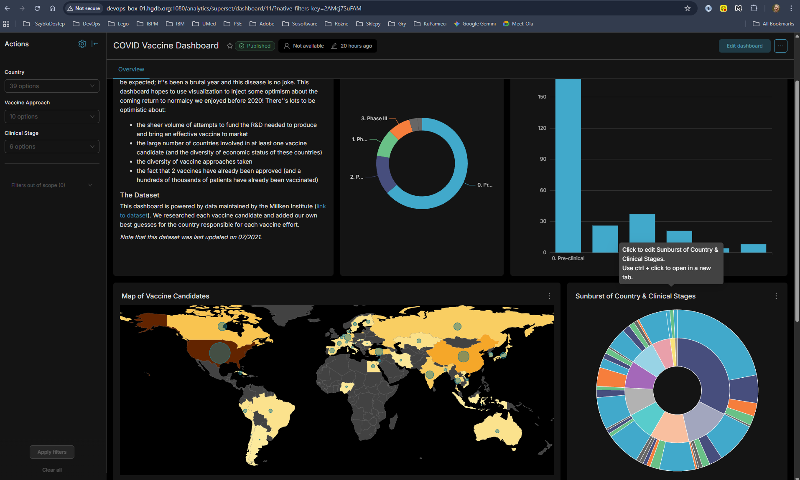

# superset-fixes

Celem projketu jest uruchomienie aplikacji **[Apache SuperSet](https://superset.apache.org/)** w środowisku kontenerowym z wykorzystaniem silnika Docker. Aby to było możliwe koniecznym było wprowadzanie proprawek do projketu Apache SuperSet. Projekt zawiera niezbędne poprawki oraz poniższą instrukcję instalacji produktu Apache SuperSet.



Po zakończonym sukcesem procesie konfiguracji i uruchomienia aplikacji, o ile nie zmmienimy konfiguracji portu, uzyskamy dostęp do usługi aplikacji pod adresem `http://<nazwa_serwera>:1080/analytics/`.

## Przygotowanie repozytorium GIT aplikacji Apache SuperSet

Poprawki zostały przygotowane dla wersji aplikacji z identyfikatorem zatwierdzenia przechowywanym w pliku `commit-id.txt`.

* Pobieranie identyfikatora zatwierdzenia:

```bash
cat commit-id.txt
```

* Sklonuj repozytorium Superset w terminalu za pomocą poniższego polecenia, w którym `<version>` to wartrość dla przygotowywanej przez nas wersji oprogramowania np. `6.0-sci`. Po pomyślnym zakończeniu tego polecenia w bieżącym katalogu powinien pojawić się nowy folder np. `superset-6.0-sci`:

```bash
git clone --depth=1 https://github.com/apache/superset.git superset-<version>
```

> [!NOTE]
> Aby lepiej zobrazować kroki postepowania założono, że identyfikator zatwierdzenia ma wartość `de5ca7980563851aabb953d0cbd05d527ce41cbb`.

* Ładujemy obsługiwany przez nas commit o id `de5ca7980563851aabb953d0cbd05d527ce41cbb`:

```bash
# Przechodzimy do katalogu projektu SuperSet (jeżeli jeszcze tego nie robiliśmy).
cd superset-6.0-sci
# Pobieranie interesującego nas punktu zatwierdzenia
git fetch origin de5ca7980563851aabb953d0cbd05d527ce41cbb
git checkout de5ca7980563851aabb953d0cbd05d527ce41cbb
```

* Po wykonaniu `checkout` możemy sprawdzić czy jesteśmy w odpowiednim commit (punkcie zatwierdzenia zmian), dla którego zostały przygotowane poprawki. W odpowiedzi na polecenie powinno pojawić się `de5ca7980563851aabb953d0cbd05d527ce41cbb`:

```bash
# Przechodzimy do katalogu projektu SuperSet (jeżeli jeszcze tego nie robiliśmy).
cd superset-6.0-sci
git rev-parse HEAD
```

## Instalalcja poprawek do aplikacji

W poprzednim kroku przygotowaliśmy odpowiedną wersję kodów aplikacji **Apache SuperSet**. W bierzącym katalogu projektu **superset-fixes** znajduje się katalog `fixes-src`. Zawiera on wszelkie poprawki niezbędne do wdrożenia produktu **Apache SuperSet** wraz z oczekiwaną funkcjonalnością. Zachowana jest oryginalna struktura katalogów projekktu Apache SuperSet.

Aby zainstalować poprawki należy skopiować pliki z katalogu `fixes-src` do katalogu `superset-6.0-sci`. Możemy się w tym celu posiłkować sktyptem `03-install.sh`. Przed jego użyciem skryptu edytuj go (zmień jeśli trzeba) i pamiętaj o ustawieniu odpowiednich wartości zmiennych `SOURCE_PATH` oraz `TARGET_PATH`:

```bash title="./03-install.sh"
# SOURCE_PATH - katalog z poprawkami.
export SOURCE_PATH="fixes-src"
# SOURCE_PATH - katalog z docelowym projketem Apache SuperSet 
export TARGET_PATH="superset-6.0-sci"
```

Po wprowadzeniu odpowiednich zmian uruchom go:

```bash
./03-install.sh
```

Katalog `fixes-src` zawiera plik [CHANGELOG.md](./fixes-src/CHANGELOG.md) opisujący cel i opis dokonanych poprawek.

## Skonfigurowanie kompozycji aplikacji

### Przygotowanie i konfiguracja wolumenów

Wolumeny kompozycji to miejsca na dysku, gdzie składowane będą dane naszego sytemu. Dla potrzeb naszej kompozycji potrzebujemy zdefiniować 6 wolumenów. Informacje te konfigurujemy w pliku `docker\.env`.

| Parametr w pliku `.env` | Domyślna wartość | Opis |
| :--- | :--- | :--- |
| `VOLUME_SUPERSET_HOME` | `/home/superset/superset_home` | Dane aplikacji SuperSet, konfiguracja. |
| `VOLUME_SUPERSET_DATA` | `/home/superset/superset_data` | Dane aplikacji SuperSet. |
| `VOLUME_DB_HOME` | `/home/superset/db_home` | Pliki danych wykorzystywanej przez aplikację SuperSet bazy danych PostgreSQL. |
| `VOLUME_REDIS_HOME` | `/home/superset/redis` | Pliki danych wykorzystywanej przez aplikację SuperSet serwer Redis.|
| `VOLUME_WEBSOCKET_NMP` | `/home/superset/superset_websocket_nmp` | Pliki danych i konfiguracja usług SuperSet-Websocket.|
| `VOLUME_NGINX_LOGS`  | `/home/superset/nginx_logs` | Katalog z logami serwera Apache Nginx pełniącego rolę proxy, strefy dostępu do usług działłająych w ramach kompozycji Docker.  |

* Tworzymy katalogi dannych systemu:

```bash
export VOLUME_SUPERSET_HOME="/home/superset/superset_home"
export VOLUME_SUPERSET_DATA="/home/superset/superset_data"
export VOLUME_DB_HOME="/home/superset/db_home"
export VOLUME_REDIS_HOME="/home/superset/redis"
export VOLUME_WEBSOCKET_NMP="/home/superset/superset_websocket_nmp"
export VOLUME_NGINX_LOGS="/home/superset/nginx_logs"
mkdir -p $VOLUME_SUPERSET_HOME
mkdir -p $VOLUME_SUPERSET_DATA
mkdir -p $VOLUME_DB_HOME
mkdir -p $VOLUME_REDIS_HOME
mkdir -p $VOLUME_WEBSOCKET_NMP
mkdir -p $VOLUME_NGINX_LOGS
```

* Weryfikujemy i jeżeli trzeba zmieniamy zawartość pliku `docker\.env`:

```properties title="./docker\.env"
VOLUME_SUPERSET_HOME=/home/superset/superset_home
VOLUME_SUPERSET_DATA=/home/superset/superset_data
VOLUME_DB_HOME=/home/superset/db_home
VOLUME_REDIS_HOME=/home/superset/redis
VOLUME_WEBSOCKET_NMP=/home/superset/superset_websocket_nmp
VOLUME_NGINX_LOGS=/home/superset/nginx_logs
```

### Konfiguracja tokenu JWT aplikacji

Token JWT jest wykorzystywany do komunikacji pomiędzy aplikacjcą SuperSet a usługami uruchamianymi w ramach kontenera SuperSet-Websocket, między innym zdalną pamięcią `redis` czy usłagami wykonywania równoległych pobrań danych.

Do wygenerowannia jego wartości możemy użyć polecenia `uuidgen`:

```bash
uuidgen
```

Polecenie wygeneruje nam unikalną wartość tokenu np.: `09795fca-8369-41b1-9dd2-d1da3424c1be`, którą możemy wykorzystać.
Zmian dokonujemy w 2 plikach:

* `docker/pythonpath_dev/superset_config.py`, plik konfiguracji aplikacji SuperSet. Edytujemy plik `superset_config.py`, wyszukujemy parametr `GLOBAL_ASYNC_QUERIES_JWT_SECRET` (domyślnie przyjmuje on wartość `"CHANGE-ME-IN-PRODUCTION-GOTTA-BE-LONG-AND-SECRET"`) i ustawiamy go na wygenerowaną wartość. Zapisujemy zmiany.
* `docker/superset-websocket/config.json`, plik konfiguracji usług SuperSet-Websocket. Edytujemy plik `config.json`, wyszukujemy parametr `jwtSecret` i ustawiamy go na wygenerowaną wartość. Zapisujemy zmiany.

> [!WARNING]
> Parametr `GLOBAL_ASYNC_QUERIES_JWT_SECRET` musi przyjować taką samą wartość jak pramaetr `"jwtSecret"` w pliku `docker/superset-websocket/config.json`.

### Inne parametry konfiguracyjne kompozycji

Większość parametrów konfiguracyjnych składowana jest w pliku `docker/.env`. Poniżej lista prametrów, na które warto zwrócić uwagę podczas konfiguracji kompozycji wykorzystywanej w celu produkcyjnym.

| Parametr w pliku `.env` | Domyślna wartość | Opis |
| :--- | :--- | :--- |
| `DATABASE_USER` | `superset` | Nazwa uzytkownika dostępu do bazy danych kontenera PostgreSQL wykorzystywane przez aplikację SuperSet (klient bazy danych). Wartość parametru musi być taka sama jak wartość parametru `POSTGRES_USER` w pliku `docker/.env`. |
| `DATABASE_PASSWORD` | `superset` | Hasło dostępu do bazy danych kontenera PostgreSQL wykorzystywane przez aplikację SuperSet (klient bazy danych). Wartość parametru musi być taka sama jak wartość parametru `POSTGRES_PASSWORD` w pliku `docker/.env`. |
| `EXAMPLES_PASSWORD` | `examples` | Konfiguracja bazy z przykładami, hasło użytkownika dostępowego do bazy. |
| `POSTGRES_USER` | `superset` | Nazwa uzytkownika dostępu do bazy danych kontenera PostgreSQL. Konfiguracja serwera babzy dannych. |
| `POSTGRES_PASSWORD` | `superset` | Hasło dostępu do bazy danych kontenera PostgreSQL. Konfiguracja serwera babzy dannych. |
| `SUPERSET_SECRET_KEY` | `TEST_NON_DEV_SECRET` | Parametr przyszłościowy. Na razie brak obsługi. Ustawia token JWT do komunikacji pomiędzy aplikacją SuperSet a usługami uruchamianymi w ramach kontenera SuperSet-Websocket. |

### Konfiguracja aplikacji SuperSet

O tym jak konfigurować aplikację znajdziemy na oficjalnych stronach Apache SuperSet [Configuring Superset](https://superset.apache.org/docs/configuration/configuring-superset). Opis dotyczy pliku `docker/pythonpath_dev/superset_config.py`.

## Uruchomienie aplikacji

>[!WARNING]
> Polecenia budowania, uruchamiania i zatrzymywania kompozycji wydajemy w katalogu projketu **Apache SuperSet** po "zainstalowaniu" poprawek i wcześniej odpowiednio przygotowanej konfiguracji kompozycji (zobacz [Skonfigurowanie kompozycji aplikacji](#skonfigurowanie-kompozycji-aplikacji) ).

* **Budowa kompozycji** - kompozycję aplikacji budujemy i uruchamiamy poleceniem:

```bash
docker compose --env-file docker/.env up --build
```

* **Uruchomienie kompozycji** - kompozycję aplikacji uruchamiamy poleceniem:

```bash
docker compose --env-file docker/.env up -d
```

* **Zatrzymanie kompozycji** - kompozycję aplikacji zatrzymujemy poleceniem:

```bash
docker compose --env-file docker/.env down
```

Więcej informacji na temat obsługi kompozycji kontenerów **Docker** uzyskasz na stronach [Docker Compose](https://docs.docker.com/compose/) oraz [Docker Hub](https://hub.docker.com/).

## Końcowe uwagi dla developerów

Poprawki wprowadzamy w projecie, którego kody pobraliśmy i przygotowaliśmy metodą opisaną w **Przygotowanie repozytorium GIT aplikacji Apache SuperSet**. Pamiętajmy o prowadzeniu listy zmienionych plików i bieżącej aktualizacji skryptów i plików pomocniczych.

| Nazwa pliku | Opis |
| :--- | :--- |
| `01-deploy-test.sh` | Skrypt pomocniczy pozwalający na wysłanie zmian do maszyny, na której testowane jest rozwiązanie. |
| `02-relelase-fixes.sh` | Skrypt pomocniczy pozwalający utworzenie paczki zmian gotowych do instalacji. |
| `03-install.sh` | Skrypt pomocniczy będący podstawą instalacji. Zobacz opis **[Instalalcja poprawek do aplikacji](#instalalcja-poprawek-do-aplikacji)**. |

## Utworzenie obrazów kontenerów Docker'a

Obrazy utworzą się automatycznie podczas uruchomienia kompozycji z opcja `--build`. Możemy jednak przygotować wczesniej obraz aplikacji i ewentualnie umieścić go w repozytorium Docker by przyspieszyć tworzenie kompozycji. Poniżej polecenia tworzenia obrazów.

>[!WARNING]
> Polecenia tworzenia obrazów wydajemy w katalogu projketu **Apache SuperSet** po "zainstalowaniu" poprawek. Pamiętaj również o tym, by odpowiednio zmodyfikować konfigurację kompozycji w pliku `docker-compose.yml` tak aby użyła utworzone przez nas obrazy.

* **Obraz podstawowy aplikacji** - poniżej polecenie tworzenia obrazu dla kontenera aplikacji SuperSet:

```bash
# Załóżmy tworzenie wersji `superset-6.0-sci`
export SUP_VERSION=superset-6.0-sci
docker build -f Dockerfile \
  --build-arg DEV_MODE=true \
  --build-arg INCLUDE_CHROMIUM=false \
  --build-arg INCLUDE_FIREFOX=false \
  --build-arg BUILD_TRANSLATIONS=false \
  --build-arg LOAD_EXAMPLES_DUCKDB=true \
  --no-cache -t apache/superset:$SUP_VERSION .
```

* **Obraz dla kontenera węzła (node)** - poniżej polecenie tworzenia obrazu dla kontenera węzła (node):

```bash
# Załóżmy tworzenie wersji `superset-node-6.0-sci`
export SUP_NODE_VERSION=superset-node-6.0-sci
docker build -f Dockerfile \
  --build-arg DEV_MODE=true \
  --build-arg BUILD_TRANSLATIONS=false \
  --no-cache -t apache/superset:$SUP_NODE_VERSION .
```

* **Obraz dla SuperSet-Websocket** - podobnie jak z tworzeniem obrazu podstawowego możemy utworzyć obraz dla kontenera z usługami SuperSet-Websocket:

```bash
# Załóżmy tworzenie wersji `superset-6.0-sci`
export SUP_VERSION=superset-6.0-sci
cd superset-websocket
docker build -f Dockerfile --no-cache -t apache/superset-websocket:$SUP_VERSION .
```

## GUI wspierające zarządzanie kontenerami

Do zarządzania kontenerami Docker w środowisku Linux możemy się wesprzeć oprogramowaniem **[portainer.io](https://www.portainer.io/solutions/portainer-for-enterprise)**.

### Uruchomineie Portainer

* **Ustaw wolumen kompozycji**. Domyślnie jest to katalog `/home/portainer/data`.
* **Konfiguracja SSL** - [Portainer - how to specify SSL in docker-compose.yml?](https://stackoverflow.com/questions/52819468/portainer-how-to-specify-ssl-in-docker-compose-yml)
* **Definicja kompozycji** jest w pliku `portainer-compose.yml`
* **Usługa dostępna** będzie pod adresem: `https://<nazwa_serwera>:9002`

### Uruchomienie kompozycji Portainer

Poniżej polecenie uruchomienia kompozycji dla **Portainer**:

```bash
docker compose -f portainer-compose.yml up -d
```

### Problem adresu `0.0.0.0`

* **Problem:** Odsłonięte porty w widoku kontenera przekierowują mnie do adresu 0.0.0.0. Co mogę zrobić?
* **Rozwiązanie:** Za pomocą interfejsu użytkownika Portainer:
  * Z menu wybierz `Environments`.
  * Wybierz środowisko (np. `local`).
  * W polu `Public IP` wprowadź adres IP hosta.
  * Kliknij `Update environment`.
