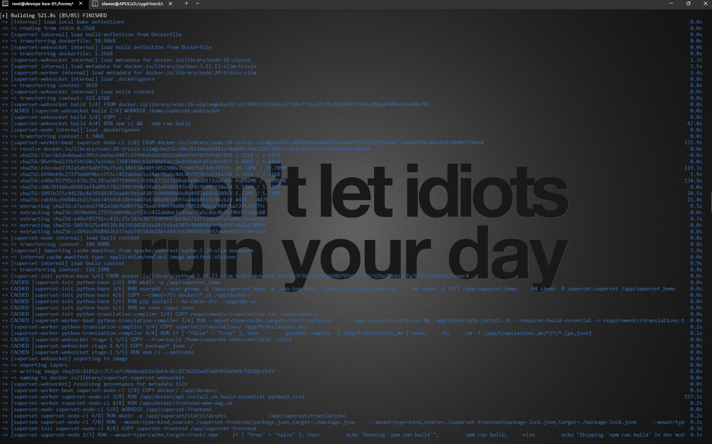
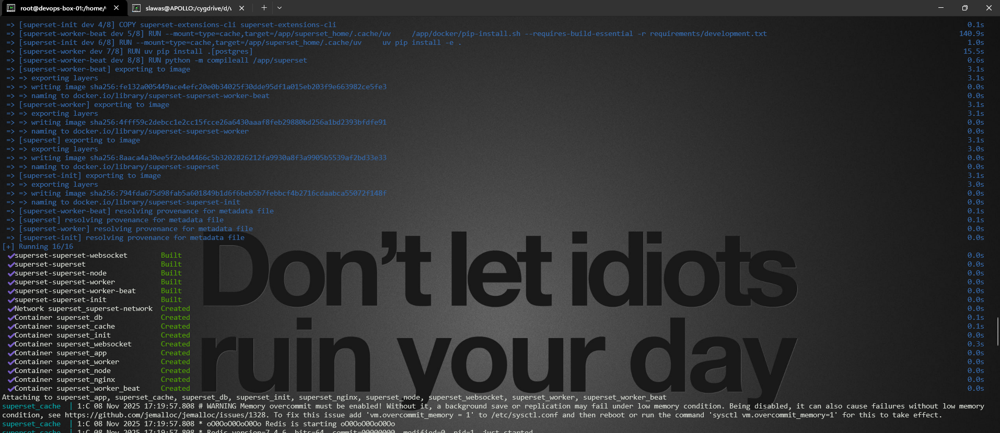
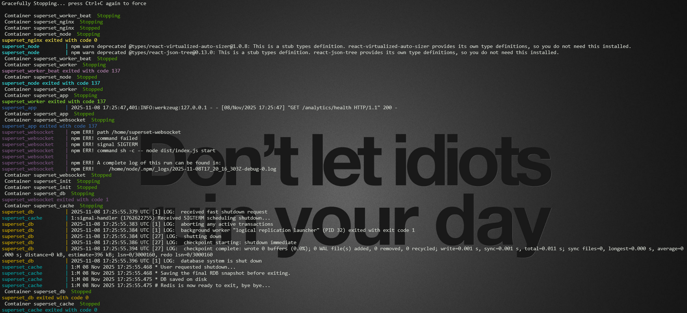

# Przykładowy scenariusz instalacji

Założennia do realizacji scenariusza instalacji aplikacji:

* **System operacyjny** Rocky Linux release 9.6 (Blue Onyx)
* **Nazwa serwera** devops-box-01.hgdb.org
* **IP serwera** 192.168.3.108
* **Docker** version 28.5.1, build e180ab8

## Kroki przeprowadzenia senariusza

### 1. Przygotowanie katalogu roboczego

* Wykonane polecenia linii komend tworzenia katalogu roboczego:

```bash
[root@devops-box-01 ~]# mkdir -p /home/workspace/git
[root@devops-box-01 ~]# cd /home/workspace/git
```

### 2. Klonowanie repozytorium projektu `superset-fixes`

* Wykonane polecenia linii komend:

```bash
[root@devops-box-01 git]# git clone https://github.com/SciSoftwareSlawomirCichy/superset-fixes.git
```

&nbsp;&nbsp;➔ Odpowiedź polecenia linii komend:

```text title="Odpowiedź"
Klonowanie do „superset-fixes”...
remote: Enumerating objects: 110, done.
remote: Counting objects: 100% (110/110), done.
remote: Compressing objects: 100% (72/72), done.
remote: Total 110 (delta 30), reused 99 (delta 23), pack-reused 0 (from 0)
Pobieranie obiektów: 100% (110/110), 666.48 KiB | 756.00 KiB/s, gotowe.
Rozwiązywanie delt: 100% (30/30), gotowe.
```

* Weryfikacja zawartości katalogu roboczego. Wykonane polecenia linii komend:

```bash
[root@devops-box-01 git]# ls -la
```

&nbsp;&nbsp;➔ Odpowiedź polecenia linii komend:

```text title="Odpowiedź"
razem 12
drwxr-xr-x.  7 scichy scichy  114 11-08 17:35 .
drwx------. 16 scichy scichy 4096 10-17 17:48 ..
drwxr-xr-x.  6 scichy scichy  163 08-10 20:17 bawgitrepo
drwxr-xr-x.  3 scichy scichy   64 08-10 20:15 devops-box-01
drwxr-xr-x. 10 scichy scichy 4096 08-10 20:01 docker-openldap-proxy
drwxr-xr-x.  2 scichy scichy  125 08-10 20:30 .git-certs
drwxr-xr-x.  5 root   root   4096 11-08 17:35 superset-fixe
```

### 3. Weryfikacja identyfikatora zatwierdzenia w projkecie `superset`

* Wykonane polecenia linii komend:

```bash
[root@devops-box-01 git]# cd superset-fixes/
[root@devops-box-01 superset-fixes]# export COMMIT_ID=`cat commit-id.txt`
[root@devops-box-01 superset-fixes]# echo ${COMMIT_ID}
```

&nbsp;&nbsp;➔ Odpowiedź polecenia linii komend:

```text title="Odpowiedź"
de5ca7980563851aabb953d0cbd05d527ce41cbb
```

### 4. Klonowanie repozytorium projektu `superset`

* Wykonane polecenia linii komend:

```bash
[root@devops-box-01 superset-fixes]# cd ..
[root@devops-box-01 git]# git clone --depth=1 https://github.com/apache/superset.git superset-6.0-sci
```

&nbsp;&nbsp;➔ Odpowiedź polecenia linii komend:

```text title="Odpowiedź"
Klonowanie do „superset-6.0-sci”...
remote: Enumerating objects: 7806, done.
remote: Counting objects: 100% (7806/7806), done.
remote: Compressing objects: 100% (6605/6605), done.
remote: Total 7806 (delta 2299), reused 3448 (delta 1009), pack-reused 0 (from 0)
Pobieranie obiektów: 100% (7806/7806), 109.39 MiB | 1.53 MiB/s, gotowe.
Rozwiązywanie delt: 100% (2299/2299), gotowe.
```

### 5. Ustawienie punktu zatwierdzenia projektu `superset`

* Wykonane polecenia linii komend w celu pobrania interesującego nas punktu zatwierdzenia projektu `superset`:

```bash
[root@devops-box-01 git]# cd superset-6.0-sci
[root@devops-box-01 superset-6.0-sci]# git fetch origin de5ca7980563851aabb953d0cbd05d527ce41cbb
```

&nbsp;&nbsp;➔ Odpowiedź polecenia linii komend:

```text title="Odpowiedź"
remote: Enumerating objects: 246164, done.
remote: Counting objects: 100% (246156/246156), done.
remote: Compressing objects: 100% (64016/64016), done.
remote: Total 241926 (delta 178323), reused 236272 (delta 172695), pack-reused 0 (from 0)
Pobieranie obiektów: 100% (241926/241926), 615.11 MiB | 1.34 MiB/s, gotowe.
Rozwiązywanie delt: 100% (178323/178323), wykonano z 2904 lokalnymi obiektami.
Z https://github.com/apache/superset
 * branch                de5ca7980563851aabb953d0cbd05d527ce41cbb -> FETCH_HEAD
```

* Wykonane polecenia linii komend:

```bash
[root@devops-box-01 superset-6.0-sci]# git checkout de5ca7980563851aabb953d0cbd05d527ce41cbb
```

&nbsp;&nbsp;➔ Odpowiedź polecenia linii komend:

```text title="Odpowiedź"
Uwaga: przełączanie na „de5ca7980563851aabb953d0cbd05d527ce41cbb”.

Jesteś w stanie „odłączonego HEAD”. Możesz się rozglądać, tworzyć
eksperymentalne zmiany i je składać, i możesz odrzucić wszystkie zapisy,
które złożysz w tym stanie, bez wpływu na żadną gałąź, przełączając z powrotem na jakąś gałąź.

Jeśli chcesz utworzyć nową gałąź, która zachowa zapisy, które złożysz,
możesz to zrobić (teraz lub później) używając -c w ponownym poleceniu przełączenia.
Przykład:

  git switch -c <nazwa-nowej-gałęzi>

Lub cofnąć tę operację przez:

  git switch -

Wyłącz tę poradę ustawiając zmienną konfiguracji advice.detachedHead na false

HEAD wskazuje teraz na de5ca7980 chore(deps): 
  update chalk requirement from ^5.4.1 to ^5.6.2 in /superset-frontend/packages/generator-superset (#35391)
```

* Weryfikacja, czy projekt `superset` jest w odpowiednim punkcie zatwierdzenia:

```bash
[root@devops-box-01 superset-6.0-sci]# git rev-parse HEAD
```

&nbsp;&nbsp;➔ Odpowiedź polecenia linii komend:

```text title="Odpowiedź"
de5ca7980563851aabb953d0cbd05d527ce41cbb
```

### 6. Instalalcja poprawek do aplikacji

* Weryfikacja poprawności konfiguracji skryptu `03-install.sh`. Wykonane poleceń linii komend:

```bash
[root@devops-box-01 superset-6.0-sci]# cd ../superset-fixes
[root@devops-box-01 superset-fixes]# cat 03-install.sh | grep "_PATH"
```

&nbsp;&nbsp;➔ Odpowiedź polecenia linii komend prerzentuje lokalizacje odpowieidnich katalogów względem lokalizacji skryptu:

```bash title="Odpowiedź"
# SOURCE_PATH - katalog z poprawkami.
export SOURCE_PATH="fixes-src"
# SOURCE_PATH - katalog z docelowym projketem Apache SuperSet
export TARGET_PATH="../superset-6.0-sci"
```

* Weryfikacja uprawnnień do uruchomienia skryptu `03-install.sh`. Wykonane poleceń linii komend:

```bash
[root@devops-box-01 superset-fixes]# ls -la | grep "03-install.sh"
```

&nbsp;&nbsp;➔ Odpowiedź polecenia linii komend:

```text title="Odpowiedź"
-rw-r--r--. 1 root   root    1073 11-08 17:35 03-install.sh
```

* Poprawienie uprawnień do uruchomienia skryptu `03-install.sh` i wykonanie skryptu:

```bash
[root@devops-box-01 superset-fixes]# chmod u+x 03-install.sh
[root@devops-box-01 superset-fixes]# ./03-install.sh
```

&nbsp;&nbsp;➔ Odpowiedź polecenia linii komend:

```text title="Odpowiedź"
Uploading file: ../superset-6.0-sci/docker-compose.yml
Uploading file: ../superset-6.0-sci/docker/.env
Uploading file: ../superset-6.0-sci/docker/docker-frontend.sh
Uploading file: ../superset-6.0-sci/docker/nginx/templates/superset.conf.template
Uploading file: ../superset-6.0-sci/docker/pythonpath_dev/superset_config.py
Uploading file: ../superset-6.0-sci/docker/superset-websocket/config.json
Uploading file: ../superset-6.0-sci/superset/initialization/__init__.py
Uploading file: ../superset-6.0-sci/superset/config.py
Uploading file: ../superset-6.0-sci/superset-frontend/package.json
Uploading file: ../superset-6.0-sci/superset-frontend/webpack.config.js
Uploading file: ../superset-6.0-sci/superset-frontend/webpack.proxy-config.js
Uploading file: ../superset-6.0-sci/superset-frontend/src/pages/Login/index.tsx
Uploading file: ../superset-6.0-sci/superset-frontend/src/views/routes.tsx
Uploading file: ../superset-6.0-sci/superset-frontend/packages/superset-ui-core/src/connection/SupersetClientClass.ts
```

### 7. Przygotowanie i konfiguracja wolumenów

* Wykonane polecenia linii komend:

```bash
[root@devops-box-01 superset-fixes]# cat ../superset-6.0-sci/docker/.env | grep VOLUME
```

&nbsp;&nbsp;➔ Odpowiedź polecenia linii komend:

```properties title="Odpowiedź"
VOLUME_SUPERSET_HOME=/home/superset/superset_home
VOLUME_SUPERSET_DATA=/home/superset/superset_data
VOLUME_DB_HOME=/home/superset/db_home
VOLUME_REDIS_HOME=/home/superset/redis
VOLUME_WEBSOCKET_NMP=/home/superset/superset_websocket_nmp
VOLUME_NGINX_LOGS=/home/superset/nginx_logs
```

* Utworzenie katalogówo wolumenów poleceniami linii komend:

```bash
[root@devops-box-01 superset-fixes]# export VOLUME_SUPERSET_HOME="/home/superset/superset_home"
[root@devops-box-01 superset-fixes]# export VOLUME_SUPERSET_DATA="/home/superset/superset_data"
[root@devops-box-01 superset-fixes]# export VOLUME_DB_HOME="/home/superset/db_home"
[root@devops-box-01 superset-fixes]# export VOLUME_REDIS_HOME="/home/superset/redis"
[root@devops-box-01 superset-fixes]# export VOLUME_WEBSOCKET_NMP="/home/superset/superset_websocket_nmp"
[root@devops-box-01 superset-fixes]# export VOLUME_NGINX_LOGS="/home/superset/nginx_logs"
[root@devops-box-01 superset-fixes]# mkdir -p $VOLUME_SUPERSET_HOME
[root@devops-box-01 superset-fixes]# mkdir -p $VOLUME_SUPERSET_DATA
[root@devops-box-01 superset-fixes]# mkdir -p $VOLUME_DB_HOME
[root@devops-box-01 superset-fixes]# mkdir -p $VOLUME_REDIS_HOME
[root@devops-box-01 superset-fixes]# mkdir -p $VOLUME_WEBSOCKET_NMP
[root@devops-box-01 superset-fixes]# mkdir -p $VOLUME_NGINX_LOGS
[root@devops-box-01 superset-fixes]# ls -la /home/superset/
```

&nbsp;&nbsp;➔ Odpowiedź poleceń linii komend:

```text title="Odpowiedź"
razem 8
drwxr-xr-x.  9 root             root    160 10-18 18:06 .
drwxr-xr-x. 11 root             root    139 11-07 19:15 ..
-rwxr--r--.  1 root             root    225 10-18 02:35 clean.sh
drwx------. 19 systemd-coredump input  4096 11-08 17:34 db_home
drwxr-xr-x.  2 root             root      6 10-18 00:50 nginx_config
drwxr-xr-x.  2 root             root     67 10-18 18:10 nginx_logs
drwxr-xr-x.  2 systemd-coredump input    22 11-08 17:34 redis
drwxr-xr-x.  2 scichy           scichy   29 10-18 18:10 superset_data
drwxrwxrwt.  4 scichy           scichy   82 10-18 20:42 superset_home
drwxr-xr-x.  4 scichy           scichy   72 10-18 18:10 superset_websocket_nmp
```

### 8. Konfiguracja tokenu JWT aplikacji

* Wygenerowanie tokenu za pomocą polecenia `uuidgen`:

```bash
[root@devops-box-01 superset-fixes]# uuidgen
```

&nbsp;&nbsp;➔ Odpowiedź poleceń linii komend:

```text title="Odpowiedź"
faedb435-67a9-4e4f-a0d2-ffbce3baeef1
```

* Edycja pliku `docker/pythonpath_dev/superset_config.py`. Edycja pliku za pomocą narzędzia `vim`:

```bash
[root@devops-box-01 superset-fixes]# cd ../superset-6.0-sci
[root@devops-box-01 superset-6.0-sci]# vim docker/pythonpath_dev/superset_config.py
[root@devops-box-01 superset-6.0-sci]# cat docker/pythonpath_dev/superset_config.py | grep GLOBAL_ASYNC_QUERIES_JWT_SECRET
```

&nbsp;&nbsp;➔ Odpowiedź poleceń linii komend:

```py title="Odpowiedź"
GLOBAL_ASYNC_QUERIES_JWT_SECRET = "faedb435-67a9-4e4f-a0d2-ffbce3baeef1"
```

* Edycja pliku `docker/superset-websocket/config.json`. Edycja pliku za pomocą narzędzia `vim`:

```bash
[root@devops-box-01 superset-6.0-sci]# vim docker/superset-websocket/config.json
[root@devops-box-01 superset-6.0-sci]# cat docker/superset-websocket/config.json | grep jwtSecret
```

&nbsp;&nbsp;➔ Odpowiedź poleceń linii komend:

```json title="Odpowiedź"
  "jwtSecret": "faedb435-67a9-4e4f-a0d2-ffbce3baeef1",
```

### 9. Konfiguracja frontendu aplikacji

* Wykonane polecenia linii komend. Edycja pliku za pomocą narzędzia `vim`:

```bash
[root@devops-box-01 superset-6.0-sci]# vim superset-frontend/webpack.config.js
[root@devops-box-01 superset-6.0-sci]# cat superset-frontend/webpack.config.js | grep allowedHosts
```

&nbsp;&nbsp;➔ Odpowiedź poleceń linii komend:

```js title="Odpowiedź"
    allowedHosts: ['all', 'devops-box-01.hgdb.org', '192.168.3.108'],
```

### 10. Budowannie kompozycji

* Wykonane polecenia linii komend:

```bash
[root@devops-box-01 superset-6.0-sci]# docker compose --env-file docker/.env up --build
```

&nbsp;&nbsp;➔ Odpowiedź poleceń linii komend:




> [!TIP]
> Aby zakończyć działanie kompozycji trzeba użyć kombinacji klawiszy `Ctrl+C`:



### 11. Uruchomienie kompozycji

* Wykonane polecenia linii komend:

```bash
[root@devops-box-01 superset-6.0-sci]# docker compose --env-file docker/.env up -d
```

&nbsp;&nbsp;➔ Odpowiedź poleceń linii komend:

```text title="Odpowiedź"
[+] Running 9/9
 ✔ Container superset_cache        Started                 0.1s
 ✔ Container superset_db           Started                 0.1s
 ✔ Container superset_init         Exited                 14.9s
 ✔ Container superset_websocket    Started                 0.1s
 ✔ Container superset_app          Started                 0.1s
 ✔ Container superset_node         Started                 0.1s
 ✔ Container superset_nginx        Started                 0.1s
 ✔ Container superset_worker       Started                 0.1s
 ✔ Container superset_worker_beat  Started                 0.1s
```

## Koniec

Usługa działa pod adresem: [http://devops-box-01.hgdb.org:1080/analytics/](http://devops-box-01.hgdb.org:1080/analytics/).

## Konfiguracja Proxy

Można przustąpić do akcji konfiguracji proxy, dzięki któremu: 

* Uruchomiona zostanie terminacja ruchy SSL
* Usługa zostanie uruchomiona na domyśnych portach HTTP (80) i HTTPS (443)

Ostatecznie usługa opublikowana zostanie pod adresem: `https://devops-box-01.hgdb.org/analytics/`.
